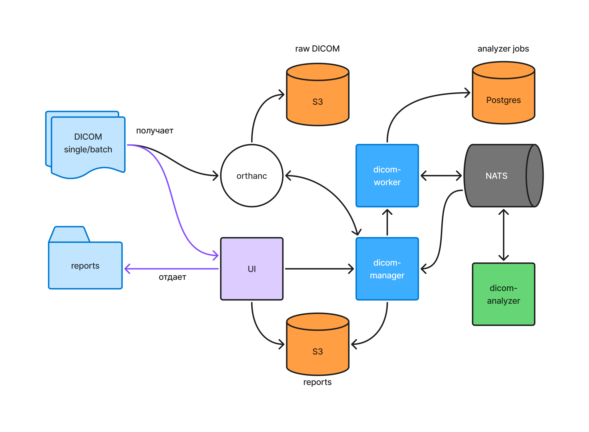

# ldt-2026 | Решение команды misis X cu = dv/du

Наша команда разработала **сервис искусственного интеллекта для оценки качества исследований плотности костей человека**. Система автоматически анализирует DICOM-снимки рентгеновской денситометрии (DXA), выявляет нарушения укладки и области интереса, показывает найденные отклонения на изображении и формирует отчеты.

Решение объединяет **рабочее место лаборанта** и **единый центр обработки исследований**. Быстрый анализ помогает оценить качество снимка прямо во время исследования, а централизованная очередь позволяет проверять исследования из медицинских организаций и обрабатывать архивы.

**Что есть в документации?**

- [Архитектура системы](#архитектура-системы)
- [Детали решения](#детали-решения)
- [Инструкция по локальному запуску](#инструкция-по-локальному-запуску)
- [ML](#ml)
- [Backend](#backend)
- [Frontend](#frontend)

## Архитектура системы



Снимок поступает через веб-приложение или Orthanc. Основное API регистрирует исследование и передает задачу в dicom-worker. Воркер сохраняет задачу и событие в одной транзакции, после чего outbox-процесс публикует задание в NATS. ML-сервис выполняет анализ и отправляет результат обратно через брокер. Результат сохраняется в базе и становится доступен в интерфейсе и отчетах.

## Детали решения

### Сервисы

#### Веб-приложение

Выступает главным сервисом для взаимодействия с пользователем. Интерфейс поддерживает **два режима работы**, которые определяются ролью пользователя при входе:

- **Специалист — рабочее место лаборанта.** Прием снимков, просмотр результатов проверки, сравнение попыток и принятие решения о качестве исследования. Лаборант видит нарушения на изображении и может переснять исследование или принять выбранную попытку.
- **Админ — рабочее место сотрудника единого центра обработки.** Общая очередь исследований, фильтрация, подробный разбор снимков, пакетная загрузка архивов, разметка и формирование отчетов.

**Результат анализа представлен через конкретные критерии качества:** пользователь видит, что проверялось, какие отклонения найдены и где они расположены на снимке.

#### Основное API — dicom-manager

Реализует методы для **загрузки DICOM-файлов**, получения статусов и результатов анализа, сохранения решений специалистов, работы с разметкой и **формирования CSV-отчетов**. Поддерживает загрузку отдельных снимков и ZIP-архивов, сохраняет метаданные пациента, исследования и оборудования.

Веб-приложение взаимодействует с API по **HTTP**, а задачи на обработку передаются в dicom-worker по **gRPC**. Такое разделение позволяет подключать внешние системы к API и развивать обработку снимков независимо от интерфейса.

**[Спецификация API](dicom-manager/docs/swagger.yaml)** · **[gRPC-контракт обработки](dicom-worker/proto/api/dicom/worker.proto)**

#### Управление обработкой — dicom-worker

Отвечает за **жизненный цикл задач**: постановку снимков на анализ, отправку событий, сохранение результатов и контроль времени выполнения. Обработка построена на **transactional outbox и NATS JetStream** с повторными попытками доставки и идемпотентным применением результатов.

Публикация событий, прием результатов и проверка таймаутов вынесены в отдельные процессы. Благодаря этому выполнение анализа не удерживает пользовательский HTTP-запрос, а состояние задачи хранится в PostgreSQL.

#### Анализ снимков — dicom-analyzer

Сервис на Python получает задания из NATS, загружает снимки из Orthanc и запускает пайплайн контроля качества. Автоматически определяет анатомическую область: **поясничный отдел позвоночника, левое или правое бедро**, после чего применяет соответствующие критерии проверки.

В результате возвращаются **нарушения, измерения, ключевые точки и контуры**, которые используются для визуализации в интерфейсе. **Инференс занимает заметно меньше секунды**, что позволяет использовать анализ в рабочем процессе лаборанта.

#### DICOM-сервер — Orthanc

Обеспечивает прием и хранение медицинских изображений с использованием **S3-совместимого хранилища MinIO**. Поддерживает поступление снимков по DICOM-протоколу и через REST API.

Для снимков, поступающих непосредственно в Orthanc, настроена **автоматическая передача в обработку** через Lua-маршрутизацию. Это позволяет встроить контроль качества в существующий поток исследований без ручной загрузки каждого файла в веб-приложение.

#### Мониторинг

Сервисы собирают **метрики, структурированные логи и трассировки**. В Grafana доступны дашборды для контроля запросов, обработки задач, ошибок и повторных доставок событий. Для хранения телеметрии используются Mimir, Loki и Tempo, для сбора — OpenTelemetry Collector и Alloy.

## Инструкция по локальному запуску

*Локальная настройка требует большого количества ручных действий и может вызвать сложности, поэтому для оценки и тестирования решения рекомендуем использовать **[развернутый прототип](https://dv-du.ru)**.*

Вместе с прототипом доступны метрики в Grafana:

- **[Grafana](https://grafana.dicom.dv-du.ru)** — мониторинг работы сервисов.

Учётные данные для входа в прототип и Grafana приведены в руководстве пользователя.

*Для запуска требуются **make**, **Docker** и **Docker Compose**. Все пути ниже указаны относительно корня репозитория.*

### Подготовка

```bash
git clone https://github.com/yogenyslav/ldt-2026.git
cd ldt-2026
cp .env.example .env
docker network create dicom-network
```

В `.env` задайте параметры доступа к PostgreSQL, NATS, Orthanc и MinIO, а также `JWT_SECRET` и `JWT_ENCRYPTION`. Для `JWT_ENCRYPTION` используйте ключ длиной **32 ASCII-символа**. Значения `S3_ACCESS_KEY` и `S3_SECRET_KEY` должны соответствовать учетным данным MinIO.

Для автоматического приема снимков из Orthanc заполните `ORTHANC_AUTOROUTE_EMAIL` и `ORTHANC_AUTOROUTE_PASSWORD` учетными данными пользователя сервиса. Для локальной демонстрации можно использовать учетную запись лаборанта (специалиста) из документации.

Поместите веса моделей в `dicom-analyzer/models/` согласно [описанию моделей](dicom-analyzer/models/README.md). Эта директория подключается к контейнеру анализатора как том.

### Инфраструктура

```bash
make run-nats
make run-storage
make run-orthanc
make run-observability
```

Откройте [консоль MinIO для снимков](http://localhost:9001), войдите с `S3_USER` и `S3_PASSWORD` из `.env` и создайте бакет **`data`**, указанный в [конфигурации Orthanc](orthanc/orthanc.json). Бакет для отчетов создается основным API автоматически.

### Сервисы приложения

После готовности инфраструктуры запустите:

```bash
make run-worker-build
make run-manager-build
make run-analyzer-build
make run-ui-build
```

После запуска доступны:

- **[Веб-приложение](http://localhost:8080)**.
- **[Swagger UI](http://localhost:10000/swagger/index.html)** — документация HTTP API.
- **[Orthanc](http://localhost:8042)** — DICOM-сервер; порт приема DICOM — `4242`.
- **[Grafana](http://localhost:3000)** — мониторинг; учетные данные задаются через `GRAFANA_USER` и `GRAFANA_PASSWORD`.
- **[MinIO для отчетов](http://localhost:9011)** — отдельное хранилище сформированных выгрузок.

## ML

### Стек технологий

Python, PyTorch, timm, OpenCV, NumPy, SciPy, pydicom, Albumentations.

### Преимущества

1. **Быстрый инференс — заметно меньше секунды на снимок.** Вычисление результата подходит для проверки качества во время исследования; доставка файла и ожидание в очереди учитываются отдельно.
2. **Сочетание нейросетей и геометрических методов.** Модели находят анатомические ориентиры и посторонние предметы, а математические алгоритмы измеряют углы, отступы и параметры укладки.
3. **Объяснимый результат.** Каждому критерию соответствуют статус проверки, измерения или координаты, которые можно показать поверх исходного снимка.
4. **Отдельные алгоритмы для позвоночника и бедра.** Система учитывает анатомическую область и сторону исследования.
5. **Обработка снимков с имплантами.** Для оценки малого вертела предусмотрен отдельный алгоритм по силуэту кости при обнаружении протеза.
6. **Локальное выполнение.** Модели работают внутри сервиса, изображения обрабатываются в развернутой инфраструктуре решения.

### Реализация

#### Определение анатомической области

Первый этап выбирает ветку анализа и определяет сторону бедра. Для классификации используется **голосование доступных признаков**: предсказания модели, геометрии костной маски и ширины изображения. Вместе с результатом сохраняется информация об уверенности и согласованности голосов.

#### Контроль качества снимков позвоночника

Проверяются **отклонение оси позвоночника**, попадание верхних краев подвздошных костей в кадр и **наличие посторонних предметов**. Ось оценивается геометрически, наличие подвздошных гребней — голосованием математического метода и моделей, а посторонние предметы выделяются сегментацией.

#### Контроль качества снимков бедра

Проверяются **отступы области интереса**, наличие трех ключевых анатомических точек и **ротация бедра по малому вертелу**. Левое и правое бедро приводятся к общей ориентации для измерений, затем координаты возвращаются в систему исходного снимка.

#### Визуализация результатов

Пайплайн возвращает структурированный результат с координатами точек, контурами областей и измерениями в градусах, сантиметрах или миллиметрах. Это позволяет **сопоставить вывод алгоритма с изображением** и принять окончательное решение по исследованию.

## Backend

### Стек технологий

- **Golang, Fiber** — HTTP API и сервисы управления обработкой.
- **PostgreSQL** — метаданные исследований, задачи, результаты, разметка и outbox.
- **gRPC, Protocol Buffers** — взаимодействие основного API с воркером.
- **NATS JetStream** — асинхронная доставка заданий и результатов анализа.
- **Orthanc** — прием и работа с DICOM-изображениями.
- **MinIO S3** — хранение исходных снимков и отчетов.
- **JWT, bcrypt** — аутентификация пользователей и хеширование паролей.
- **OpenTelemetry, Grafana, Mimir, Loki, Tempo** — метрики, логи и трассировки.
- **Docker Compose** — развертывание приложения и инфраструктуры.

### Преимущества

#### Идемпотентность и ретраи

**Задача и событие на ее обработку сохраняются в одной транзакции PostgreSQL.** Transactional outbox связывает изменение состояния с последующей отправкой сообщения: событие остается в базе до подтвержденной публикации в NATS JetStream. При ошибке отправки выполняются повторные попытки с увеличением интервала.

**NATS JetStream сохраняет сообщения и позицию подписчиков между перезапусками.** Обработчики подтверждают успешную обработку, а при временных сбоях запрашивают повторную доставку. Идентификаторы событий используются для дедупликации публикаций, а применение результатов защищено транзакциями и проверками состояния задачи: повторное сообщение не перезаписывает уже завершенный результат.

Дополнительно предусмотрен **контроль таймаутов задач**. Зависшие задания переводятся в состояние ошибки с уведомлением основного API, чтобы пользователь видел итоговый статус обработки.

#### Асинхронная архитектура

Прием снимка, анализ и обновление результата разделены между сервисами. **Пользователю не нужно держать запрос открытым до завершения ML-обработки**: интерфейс получает идентификатор задачи и отслеживает ее состояние. NATS разъединяет жизненные циклы воркера и анализатора, а gRPC-контракты явно описывают взаимодействие Go-сервисов.

#### Интеграция и отчетность

Сервис поддерживает **ручную загрузку, ZIP-архивы и поступление снимков через Orthanc**. DICOM-идентификаторы исследования и изображения сохраняются вместе с результатом, что позволяет связать проверку с исходными данными.

**CSV-отчеты** содержат идентификаторы исследования и снимка, анатомическую область, класс качества, типы нарушений, статус и время обработки. Готовые отчеты хранятся в S3 и доступны по подписанным ссылкам.

#### Наблюдаемость

Метрики и логи покрывают HTTP-запросы, создание задач, публикацию outbox, повторные доставки, результаты ML и таймауты. **Готовые дашборды Grafana** помогают видеть ошибки и задержки на отдельных этапах обработки.

## Frontend

### Стек технологий

- **TypeScript, React** — типизированный компонентный интерфейс.
- **Vite** — сборка и локальная разработка.
- **React Router** — маршрутизация с учетом роли пользователя.
- **TanStack Query, Axios** — запросы к API, кеширование и обновление данных.
- **Tailwind CSS** — стилизация интерфейса.
- **React Hook Form, Zod** — формы и валидация.
- **Nginx** — раздача приложения и проксирование API и скачивания отчетов.

### Преимущества

#### Два рабочих сценария

**Лаборант работает в режиме специалиста:** принимает снимки, видит ход анализа и нарушения, сравнивает попытки и выбирает снимок для принятия исследования. Интерфейс рабочего места автоматически обновляет данные, поступающие с сервера.

**Сотрудник единого центра обработки работает в режиме админа:** просматривает очередь, фильтрует исследования, открывает подробную карточку, загружает архивы и формирует отчеты по выбранным задачам. Роль определяет доступный набор страниц сразу после авторизации.

#### Наглядный разбор исследования

Просмотрщик совмещает **исходное изображение, визуальную разметку и список критериев**. Статусы и цветовые обозначения помогают быстро найти отклонения, а измерения объясняют результат анализа. В карточке исследования можно сохранить решение специалиста и комментарий.

#### Разметка и пакетная работа

Для экспертной разметки предусмотрены **очередь заданий и редактор снимка** с анатомическими точками, областями посторонних предметов и заметками. Пакетная загрузка показывает состояние обработки файлов из ZIP-архива и позволяет сформировать общий отчет.
